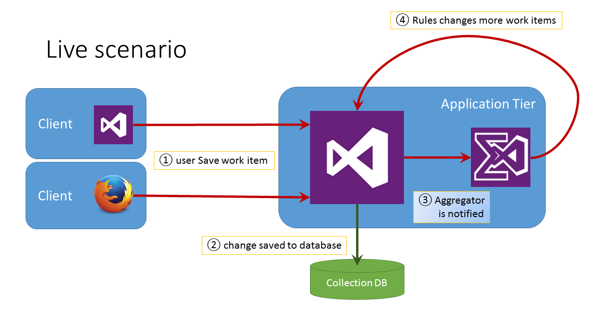

## Web Hooks

TODO

## Server Plugin

The following diagram may help understand the control flow.

 1. A user changes some work item's data using Visual Studio or TFS Web Interface, then presses the **Save** button (or hits `Ctrl-S`);
 2. TFS validates the edit and saves the changes to the database;
 3. TFS notifies the Aggregator plugin of the *ID* of the changed work item
 4.  Aggregator see which Rules apply and execute them, which may cause the loading and saving of additional work items.

> Note that step 4 may trigger Aggregator again on the just saved work items.

Keep also in mind that scripts and applications can change work items without user intervention, like [Team Foundation Server Integration Tools](https://visualstudiogallery.msdn.microsoft.com/eb77e739-c98c-4e36-9ead-fa115b27fefe). Make sure that TFS Aggregator kicks in only when intended.

## Configuration changes

Aggregator loads and parses the Rules from `TFSAggregator2.ServerPlugin.policies` file at first run. The result is cached in memory and the cache invalidates if the file changes.