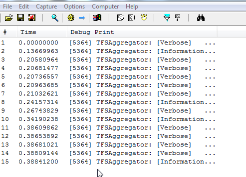

The examples are in C#

## Use Fields' Reference Names

Write your rules using the Reference name for fields, e.g. `Microsoft.VSTS.Common.Priority`.
That way your rules will work on process templates in different languages: **Priority** becomes **Priorität** in a German template.

Also the name may change in different template or newer version of the same template. Your rules are more likely to survive TFS upgrades unharmed.

## Use Link Types' Reference Names

Write your rules using the Reference name for link types, e.g. `Microsoft.VSTS.Common.TestedBy-Forward`.

## Field can be null

Remember that a work item field value is of type `object` and can be null.

Style #1: use the [null-coalescing operator](https://msdn.microsoft.com/en-us/library/ms173224.aspx)
```
(double)(self.Parent["Microsoft.VSTS.Scheduling.OriginalEstimate"] ?? 0d)
```
notice the parentheses and the cast.

Style #2: use the `GetField` helper function
```
self.Parent.GetField<double>("Microsoft.VSTS.Scheduling.OriginalEstimate", 0d)
```
internally uses a `try..catch` block.

Style #3: check the Valid property

```
var parentField = self.Parent["Microsoft.VSTS.Scheduling.OriginalEstimate"];
if (parentField.Status == FieldStatus.Valid) {
  parentField.Value += (double)self["Microsoft.VSTS.Scheduling.OriginalEstimate"];
}
```
notice that parent field is left untouched is it has no value.


## Trace your steps

Consider using the logger object in non-trivial rules or when you are uncertain of the values in use.

```
if (self.HasParent())
{
    var parent = self.Parent;
    logger.Log("Task #{0} updates {1} #{2}", self.Id, parent.TypeName, parent.Id);
    
    parent["Microsoft.VSTS.Scheduling.CompletedWork"] = parent.Children.Sum(task => task.GetField<double>("Microsoft.VSTS.Scheduling.CompletedWork", 0d));
    parent["Microsoft.VSTS.Scheduling.RemainingWork"] = parent.Children.Sum(task => task.GetField<double>("Microsoft.VSTS.Scheduling.RemainingWork", 0d));
    
    logger.Log("CompletedWork is {0}, RemainingWork is {1}", parent["Microsoft.VSTS.Scheduling.CompletedWork"], parent["Microsoft.VSTS.Scheduling.RemainingWork"]);
}
```

The output is sent to debugger output and .Net Trace. 

You can use **DebugView** from Microsoft's SysInternals site at <http://technet.microsoft.com/en-us/sysinternals/bb896647>.

DebugView is a lightweight Trace Listener and will capture the trace messages from TFSAggregator.


We would recommend adding the `*TFSAggregator:*` filter to DebugView so that you only see the TFSAggregator traces.


Make sure to enable the **Capture Global Win32** option.

> **You have to run DebugView on _all_ TFS Application Tier machines**.


## Infinite cycle

Always set a Rate Limit feature to limit the damage of infinite loops.

```
<AggregatorConfiguration>
    <runtime>
        <rateLimiting interval="00:00:01.00" changes="5" />
```


## Use Template Scope

Instead of scoping Rules to a Collection or a set of Projects, you can define to apply the Rules to any Project using a specific template. E.g.
```
<templateScope name="Scrum" />
```
Remember that name must match exactly.
Verify before each TFS upgrade if any Process Template has changed name and update your policies eventually. 


## Use *hasFields* instead of *appliesTo*

The `appliesTo` filter restrict a Rule to a specific set of work item types.
You can define a more generic rule using the `hasFields` filter. Using it the code does not depends on specific work item type and the way they are named.

This has the advantage that the rule will also work when people customize the template by copying an existing Work Item Type, like `Task` -> `In Sprint Bug`. 


## Numeric Deltas

### The Problem

Consider the following rule
```
self.Parent["Custom.RemainingWork"] = (double)self.Parent["Custom.RemainingWork"] + (double)self["Microsoft.VSTS.Scheduling.RemainingWork"];
```
The problem is that the parent value will be increased with every change.

If the child has a value of 5, the parent value will be increased by 5. When I change the child value from 5 to 2, the parent value will be increased be 2, but it should be decreased with 3.

The requirement is to aggregate the difference from the new value to the old value and not the raw new value only.

### A Solution

A simple way is adding an hidden field, say `Custom.PreviousRemainingWork`. The rule will become something like

```
double delta = (double)(self["Custom.PreviousRemainingWork"]??0d) - (double)(self["Microsoft.VSTS.Scheduling.RemainingWork"]??0d);
self.Parent["Custom.RemainingWork"] = (double)(self.Parent["Custom.RemainingWork"]??0d) + delta;
self["Custom.PreviousRemainingWork"] = (double)(self["Microsoft.VSTS.Scheduling.RemainingWork"]??0d);
```
